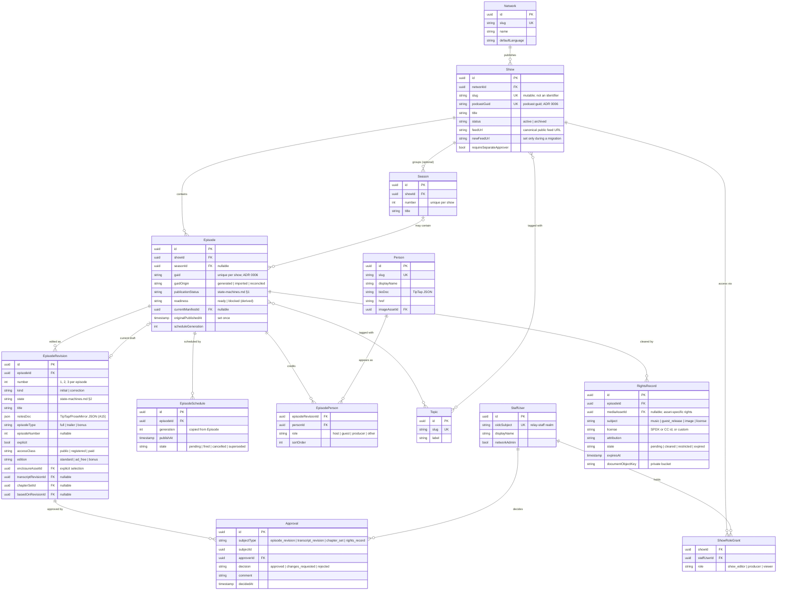
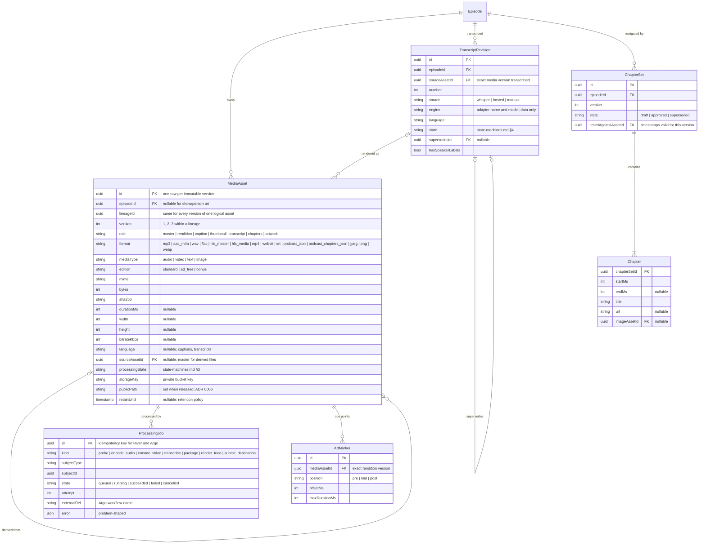
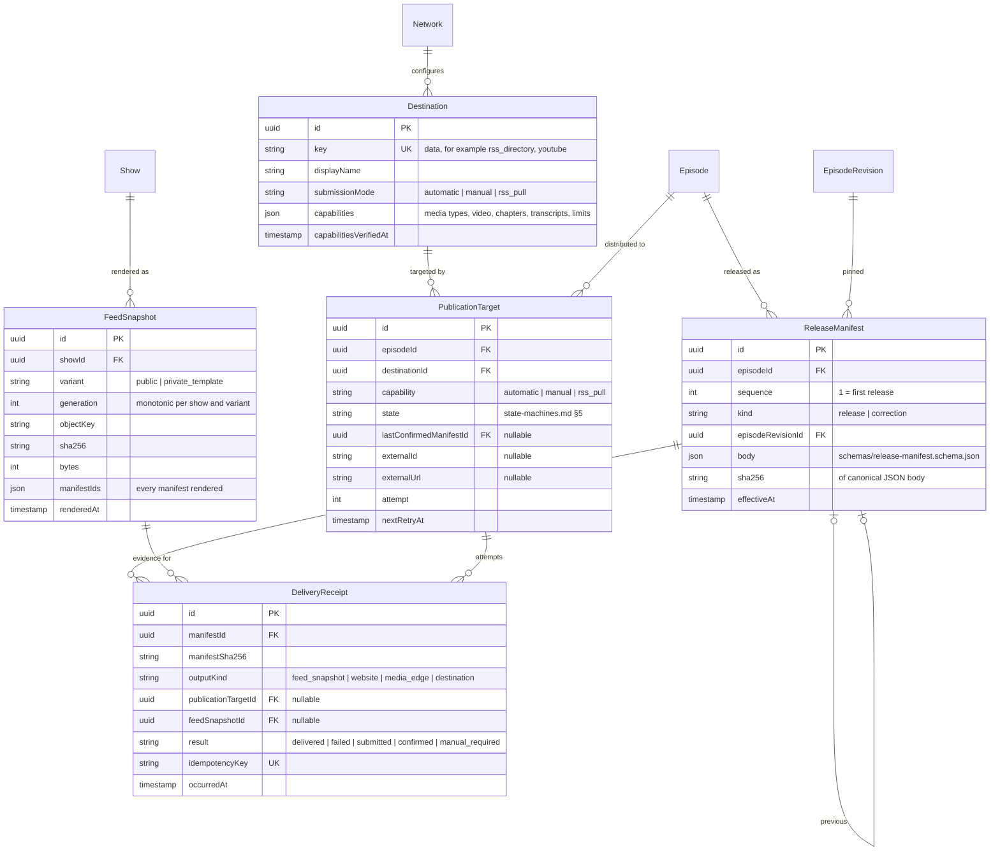
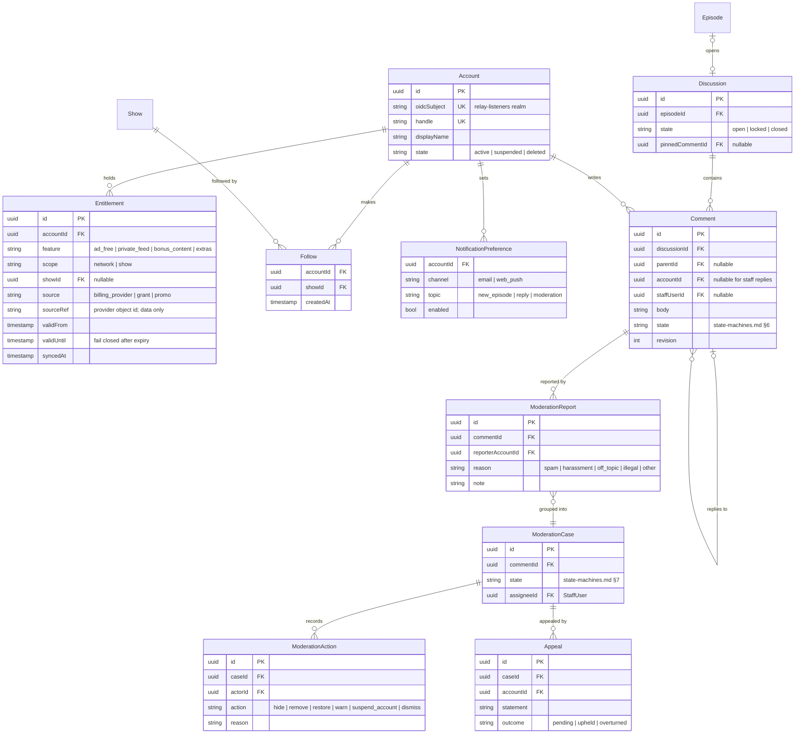
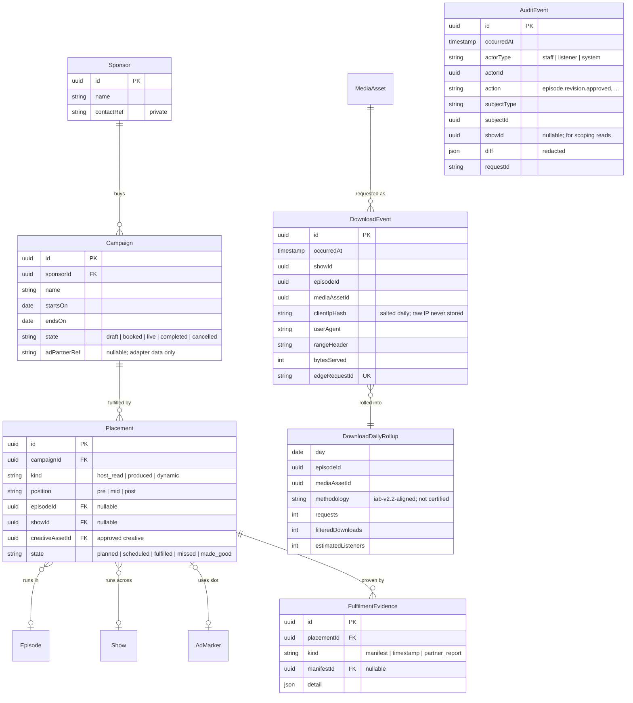

# Relay domain model

The shared entity model for every Relay slice. It covers pitch §6 ("Content and media contracts") and
models the Phase 2–3 entities (video, community, listener accounts, monetization, analytics) now, so
later slices extend it rather than reshaping it. Only Phase 1 entities have endpoints in
[`openapi/relay.v0.yaml`](../openapi/relay.v0.yaml).

Related contracts:

- [State machines](state-machines.md): every lifecycle, with guards and who may perform each transition.
- [Release manifest schema](../schemas/release-manifest.schema.json) and
  [delivery receipt schema](../schemas/delivery-receipt.schema.json).
- [ADR 0006](../adr/0006-guid-and-media-versioning.md): GUID policy and media versioning.

## Modelling rules

1. **IDs are UUIDs**, generated by the API. They are opaque and are never derived from mutable fields.
   The one exception is the episode **GUID**: a separate string that follows ADR 0006.
2. **Module ownership.** Each entity belongs to exactly one `relay-api` module (the _Module_ column in
   the glossary). A module never reads another module's tables. Cross-module links are IDs resolved
   through the owning module's Go interface. They are drawn as relationships below, but they are not
   foreign keys across module schemas.
3. **Immutable records.** `MediaAsset`, `TranscriptRevision` (once it leaves `draft`), `ChapterSet`
   (once approved), `Approval`, `ReleaseManifest`, `DeliveryReceipt`, `FeedSnapshot`, `DownloadEvent`,
   and `AuditEvent` are append-only. A change is a new row, never an update in place.
4. **Separate dimensions of state.** An episode's editable revision workflow, its readiness, its
   publication status, and the delivery state of each output are four separate fields. They are
   never folded into one status (see [state machines](state-machines.md)).
5. **Provider names are data, not types.** A destination such as `youtube` is a row in `Destination`,
   and a transcription engine is a `source` value plus an adapter name. No schema enumerates vendors.
6. **Metric families never sum.** Hosted-media, owned-experience, and destination metrics live in
   separate tables with separate definitions.
7. **Seasons are optional.** An episode may belong to a show with no seasons.
8. **Timestamps** are UTC with the `Z` suffix. Durations are integer milliseconds. Sizes are integer bytes.

## Diagrams

The model is split into five diagrams by area. Entities repeated across diagrams are the same entity.

### Catalog and editorial

### Media, transcripts, and jobs

### Publishing and distribution

### Community and listeners

### Monetization, analytics, and audit

## Entity glossary

**Phase** is when the entity gets endpoints and storage. **Module** is the `relay-api` module that
owns its tables (conventions, architecture rule 3).

### Catalog and editorial

| Entity              | Module     | Phase | Meaning                                                                                                                                                                                                                                                                                                                                                                                                                                  |
| ------------------- | ---------- | ----- | ---------------------------------------------------------------------------------------------------------------------------------------------------------------------------------------------------------------------------------------------------------------------------------------------------------------------------------------------------------------------------------------------------------------------------------------- |
| **Network**         | catalog    | 1     | The single tenant: one network, many shows (pitch §2). Holds network-wide defaults and branding.                                                                                                                                                                                                                                                                                                                                         |
| **Show**            | catalog    | 1     | A podcast with one public feed. `slug` is mutable and used only in site URLs. `podcastGuid` is the show-level `podcast:guid` (ADR 0006). `newFeedUrl` is set only while a feed migration's redirect period is running.                                                                                                                                                                                                                   |
| **Season**          | catalog    | 1     | Optional grouping inside a show. `number` maps to `podcast:season` and `itunes:season`. Shows without seasons are normal.                                                                                                                                                                                                                                                                                                                |
| **Episode**         | catalog    | 1     | The permanent identity of one episode: `guid`, the show, and the pointers to its current revision and current release. Content lives in revisions. It carries the **publication status** (§1 of the state machines) and the derived **readiness**. `originalPublishedAt` is set by the first release and never changes; it becomes the feed `pubDate` forever. `scheduleGeneration` increases on every schedule, reschedule, and cancel. |
| **EpisodeRevision** | catalog    | 1     | One editable version of an episode's content: title, notes (TipTap JSON, decision A15), credits, access class, edition, and the **explicit selection** of the enclosure asset, transcript revision, and chapter set. `kind: correction` marks a revision created after the episode was first released. A revision is frozen once it is submitted for review. Edits after that create a new revision.                                     |
| **EpisodeSchedule** | publishing | 1     | One scheduling decision. Carries the episode's `scheduleGeneration` at the time. The publish job runs only if the generation still matches, so a stale job cannot publish.                                                                                                                                                                                                                                                               |
| **Person**          | catalog    | 1     | A host, guest, or producer shared across the network. Feeds `podcast:person` and the connected archive (P2-08).                                                                                                                                                                                                                                                                                                                          |
| **EpisodePerson**   | catalog    | 1     | A credit: person plus role (`host`, `guest`, `producer`, `other`) on one revision, so corrections can change credits.                                                                                                                                                                                                                                                                                                                    |
| **Topic**           | catalog    | 1     | A network-wide subject tag on shows and episodes. Used for discovery and curated recommendations.                                                                                                                                                                                                                                                                                                                                        |
| **StaffUser**       | catalog    | 1     | A staff identity from the `relay-staff` Keycloak realm. `networkAdmin` is the only network-wide staff flag. Everything else is show-scoped.                                                                                                                                                                                                                                                                                              |
| **ShowRoleGrant**   | catalog    | 1     | Show-scoped RBAC: `show_editor` (approves, schedules, publishes), `producer` (creates and edits drafts, uploads, submits for review), `viewer` (read-only). Moderators are a network role granted in P2-07.                                                                                                                                                                                                                              |
| **RightsRecord**    | catalog    | 1     | Evidence that the episode, or one asset, may be published: licence (an SPDX or Creative Commons identifier where one exists), attribution, clearance state, expiry, and a private document. Blocks readiness until it is `cleared`. Pinned into the manifest for export.                                                                                                                                                                 |
| **Approval**        | publishing | 1     | An immutable editorial decision on a revision, transcript revision, chapter set, or rights record. Rule 6 of the conventions (AI output is a draft) is enforced by requiring an approval before any machine output is released.                                                                                                                                                                                                          |

### Media, transcripts, and jobs

| Entity                 | Module      | Phase | Meaning                                                                                                                                                                                                                                                                                                                                                                                                         |
| ---------------------- | ----------- | ----- | --------------------------------------------------------------------------------------------------------------------------------------------------------------------------------------------------------------------------------------------------------------------------------------------------------------------------------------------------------------------------------------------------------------- |
| **MediaAsset**         | media       | 1     | **One immutable file version.** Every version of a logical asset shares a `lineageId`, and `version` counts within it. `role` (what it is for) is separate from `format` (how it is encoded), so one schema serves audio, video, captions, and premium editions. Masters are never modified. A derived file names its `sourceAssetId`. `publicPath` is assigned when a release first uses the asset (ADR 0006). |
| **ProcessingJob**      | media       | 1     | The durable application record of one unit of background work. Its `id` is the idempotency key passed to River and Argo, so a retry never duplicates output.                                                                                                                                                                                                                                                    |
| **TranscriptRevision** | transcripts | 1     | One transcript of one exact media version. `source` is `whisper` (self-hosted faster-whisper), `hosted`, or `manual`. The engine name is data. Machine output starts as `draft`. Rendered files (`podcast_json`, `webvtt`, `srt`) are `MediaAsset` rows with `role: transcript` or `caption`.                                                                                                                   |
| **ChapterSet**         | catalog     | 1     | A versioned list of chapters, timed against one exact media version (`timedAgainstAssetId`). A new master version needs a new chapter set or an explicit re-approval.                                                                                                                                                                                                                                           |
| **Chapter**            | catalog     | 1     | Start time, optional end, title, optional link and image. Rendered to `podcast:chapters` JSON at release time.                                                                                                                                                                                                                                                                                                  |
| **AdMarker**           | sponsorship | 3     | An ad slot (pre, mid, post) at an offset in one exact rendition version. Modelled now so the manifest can pin it. The DAI adapter (P3-05) consumes it.                                                                                                                                                                                                                                                          |

### Publishing and distribution

| Entity                | Module       | Phase | Meaning                                                                                                                                                                                                                                                                                                                                                      |
| --------------------- | ------------ | ----- | ------------------------------------------------------------------------------------------------------------------------------------------------------------------------------------------------------------------------------------------------------------------------------------------------------------------------------------------------------------ |
| **ReleaseManifest**   | publishing   | 1     | **The immutable record of one publish** ([schema](../schemas/release-manifest.schema.json)). It pins the approved revision, asset versions with SHA-256, the transcript revision, the chapter set, public episode and show metadata, access class, edition, approvers, and the original publication time. It never contains feed hashes or delivery results. |
| **DeliveryReceipt**   | publishing   | 1     | **The immutable record of one output attempt** for a manifest ([schema](../schemas/delivery-receipt.schema.json)): a feed snapshot write, a site build, an edge check, or a destination submission. It references the manifest by ID and SHA-256. Delivery state is derived from receipts, never stored on the manifest.                                     |
| **FeedSnapshot**      | feeds        | 1     | A rendered RSS document in object storage, with a generation number and SHA-256. The edge serves the latest snapshot even when the API is down (architecture rule 2). `private_template` is the Phase 3 per-subscriber variant.                                                                                                                              |
| **Destination**       | distribution | 1     | A place an episode can be distributed, and its capability matrix: submission mode, supported media, limits, and when the capabilities were last verified. The key (`youtube`, `rss_directory`) is data.                                                                                                                                                      |
| **PublicationTarget** | distribution | 1     | One episode at one destination, with its own state machine (§5). Phase 1 creates targets for RSS-pull directories. Automatic adapters arrive in P2-09.                                                                                                                                                                                                       |

### Community and listeners (Phase 2–3)

| Entity                     | Module    | Phase | Meaning                                                                                                                                                                                                              |
| -------------------------- | --------- | ----- | -------------------------------------------------------------------------------------------------------------------------------------------------------------------------------------------------------------------- |
| **Account**                | community | 2     | A listener identity from the `relay-listeners` realm. The free tier (A10: comment, follow, notifications) needs only an account.                                                                                     |
| **Entitlement**            | billing   | 3     | A paid capability (`ad_free`, `private_feed`, `bonus_content`, `extras`) for the network or one show. It is synced from the billing adapter and stored locally. After `validUntil` the entitlement **fails closed**. |
| **Follow**                 | community | 2     | An account following a show. Drives notifications.                                                                                                                                                                   |
| **NotificationPreference** | community | 2     | Per-account, per-channel, per-topic opt-in.                                                                                                                                                                          |
| **Discussion**             | community | 2     | The optional comment thread for one episode, with open, locked, or closed state and a pinned host answer.                                                                                                            |
| **Comment**                | community | 2     | A listener comment or staff reply, threaded by `parentId`, with the moderation state machine (§6).                                                                                                                   |
| **ModerationReport**       | community | 2     | One listener's report of a comment, with a reason.                                                                                                                                                                   |
| **ModerationCase**         | community | 2     | The staffed queue item that groups reports on one comment (§7). Every action is recorded as a **ModerationAction**, and a decision can be contested with an **Appeal**.                                              |

### Monetization, analytics, and audit

| Entity                  | Module      | Phase | Meaning                                                                                                                                                                                                                                                                                                            |
| ----------------------- | ----------- | ----- | ------------------------------------------------------------------------------------------------------------------------------------------------------------------------------------------------------------------------------------------------------------------------------------------------------------------ |
| **Sponsor**             | sponsorship | 3     | An advertiser. Contact details are private.                                                                                                                                                                                                                                                                        |
| **Campaign**            | sponsorship | 3     | A sponsor commitment with dates and state. `adPartnerRef` links to the DAI adapter (A11) as data.                                                                                                                                                                                                                  |
| **Placement**           | sponsorship | 3     | One sold slot in an episode, or across a show: kind, position, approved creative, and fulfilment state.                                                                                                                                                                                                            |
| **FulfilmentEvidence**  | sponsorship | 3     | Proof that a placement ran: a release manifest (for baked-in reads), timestamps, or a partner delivery report. Used by reconciliation (P3-06).                                                                                                                                                                     |
| **DownloadEvent**       | analytics   | 1     | A **raw** hosted-media request from edge logs. The raw IP is never stored, only a daily salted hash. `edgeRequestId` makes ingest idempotent.                                                                                                                                                                      |
| **DownloadDailyRollup** | analytics   | 1     | Filtered downloads per day, episode, and asset version, labelled with its methodology. It is aligned with IAB v2.2 and never claims certification. **Hosted-media family only.** Owned-experience events (P2-10) and imported destination reports (P2-10) get their own tables and are never summed with this one. |
| **AuditEvent**          | (each)      | 1     | An append-only record of every state-changing command, written in the same transaction as the change. Diffs are redacted (no tokens, signed URLs, or personal data). Read through the audit-events API, scoped by show.                                                                                            |

## Enumerations

The canonical enum values are defined once in [`openapi/relay.v0.yaml`](../openapi/relay.v0.yaml)
`components/schemas` and in the manifest schema. This document explains them but does not define them.
If the two ever disagree, the schemas win, and this file is fixed.
