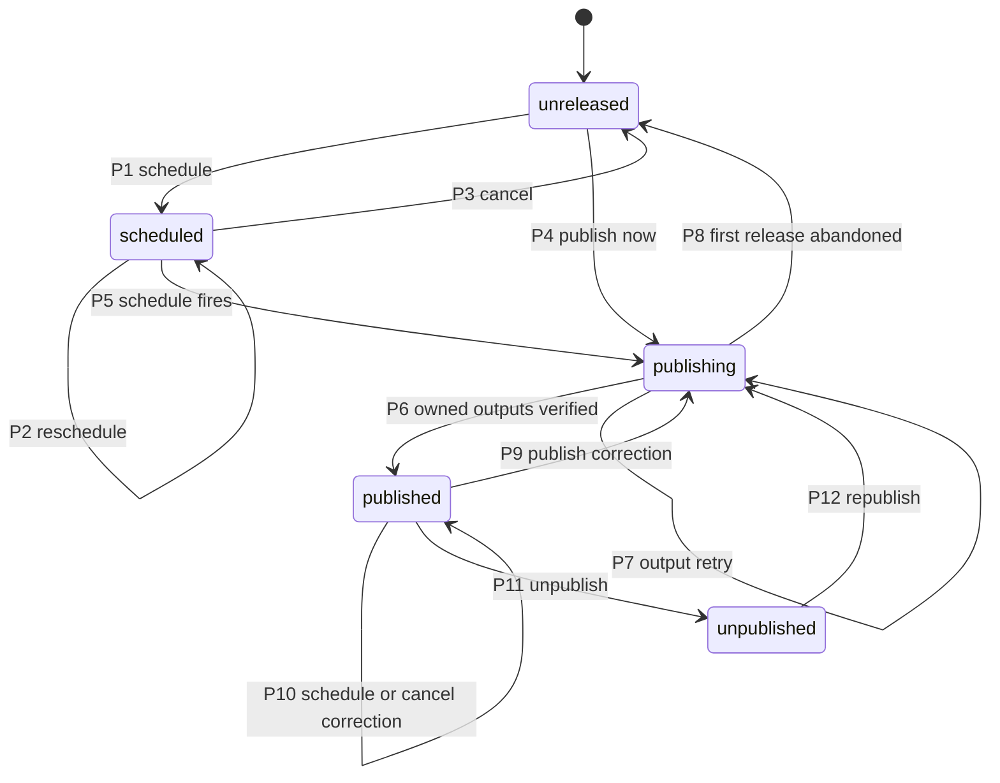
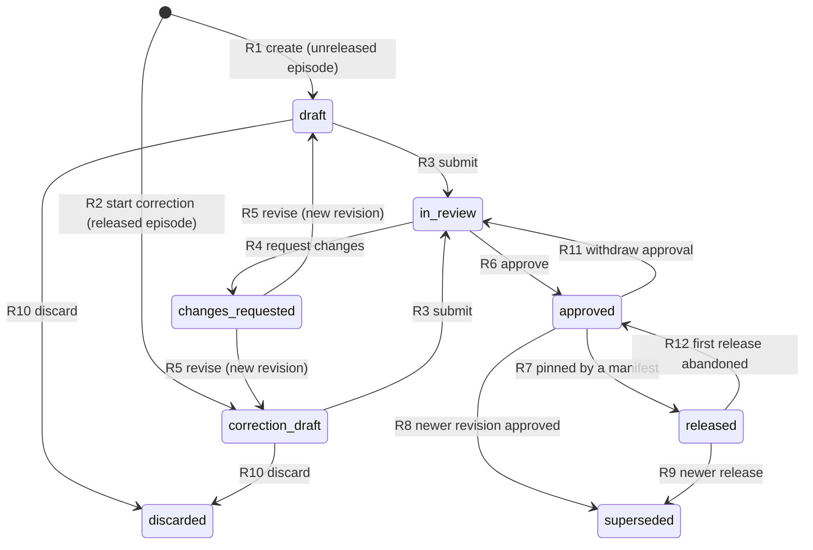
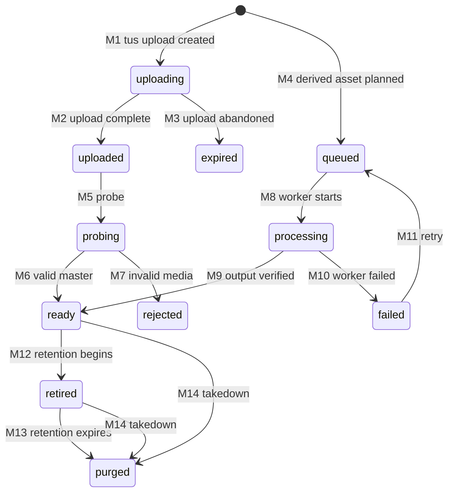
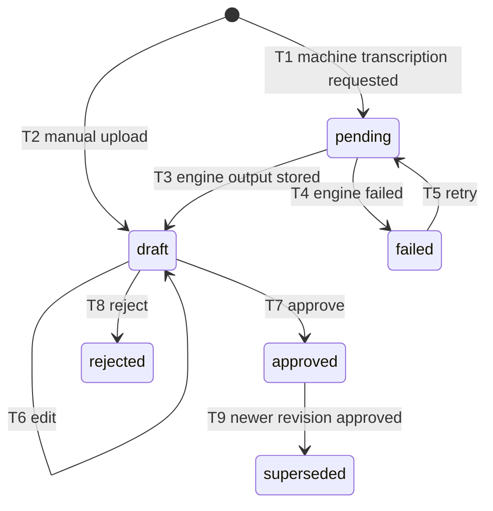
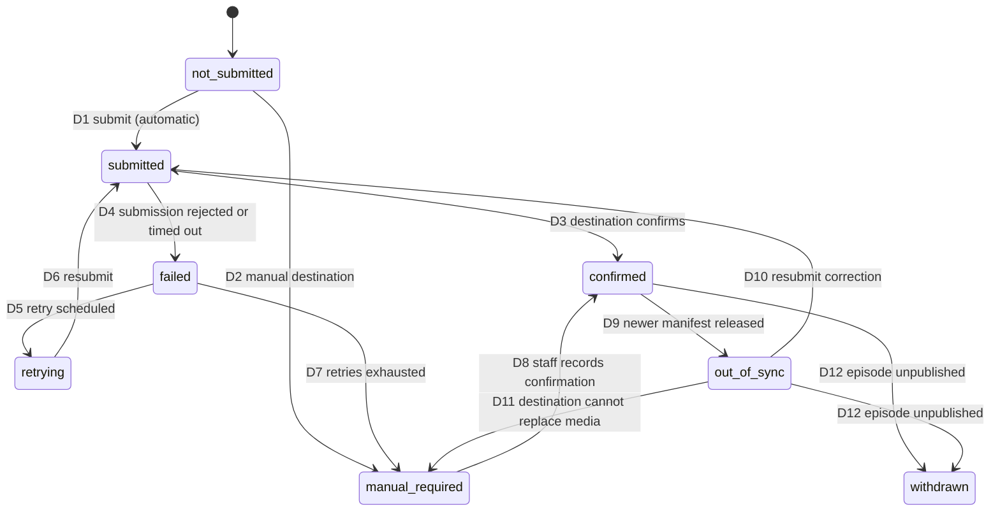
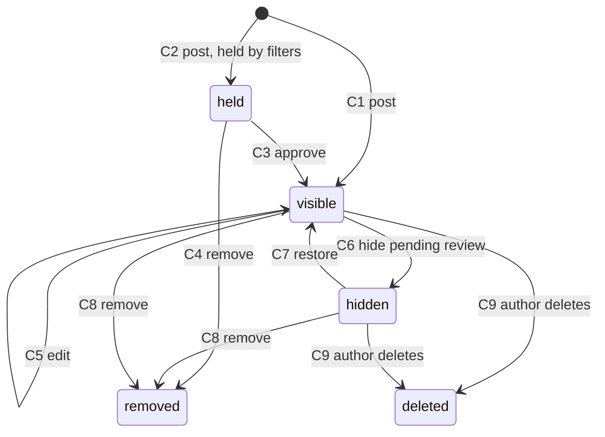
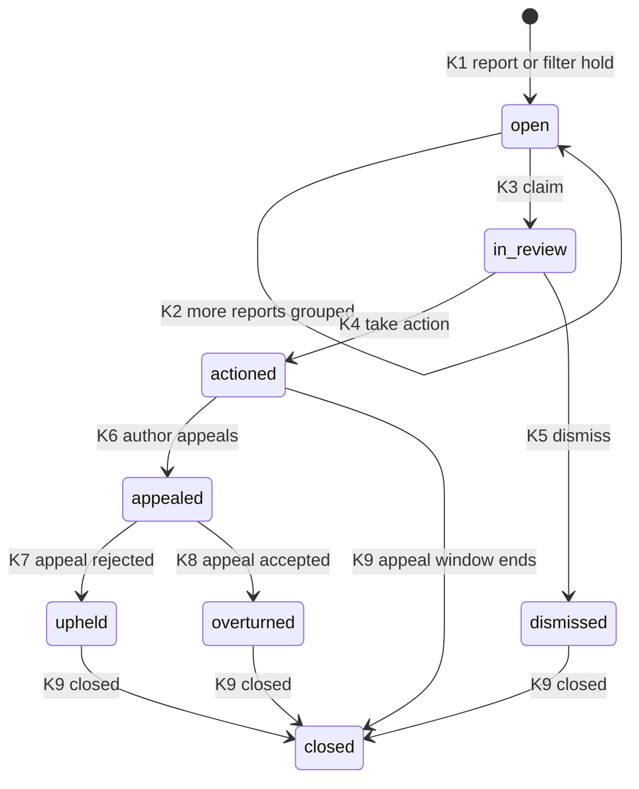

# Relay state machines

Each lifecycle in the [domain model](erd.md). Every transition lists its **guard** (what must be true)
and its **actor** (who may perform it). The API rejects any transition that is not listed, returning
`409` with a `problem+json` body of type `…/problems/invalid-transition`.

## Actors

| Actor             | Meaning                                                                                         |
| ----------------- | ----------------------------------------------------------------------------------------------- |
| `producer`        | Staff with the `producer` grant on the show.                                                    |
| `editor`          | Staff with the `show_editor` grant on the show.                                                 |
| `admin`           | Staff with `networkAdmin`. Admins may do anything an editor may, on every show.                 |
| `moderator`       | Staff with the network moderator grant (P2-07).                                                 |
| `system`          | A background job (River or Argo) acting on a durable `ProcessingJob`, never on a user's behalf. |
| `listener`        | A signed-in `Account`, acting on its own content.                                               |
| `listener:author` | The listener who wrote the comment in question.                                                 |

"`editor+`" means `editor` or `admin`. "`producer+`" means `producer`, `editor`, or `admin`.

**Separate approver.** When `Show.requireSeparateApprover` is true (the default), the approving editor
must not be the staff user who submitted the revision. For a solo demo, an admin can turn this off
per show. The change is audited.

## How the episode's state is split

Pitch §5 and the review clarifications need one episode to answer several independent questions at
once. For example: "the correction is in review, the episode is still published, the feed is current,
and YouTube is out of date". A single status field cannot hold that, so the episode's state is split
into four dimensions:

| Dimension                  | Stored on                                                     | Values                                                                                                           | Answers                                     |
| -------------------------- | ------------------------------------------------------------- | ---------------------------------------------------------------------------------------------------------------- | ------------------------------------------- |
| **§1 Publication status**  | `Episode.publicationStatus`                                   | `unreleased`, `scheduled`, `publishing`, `published`, `unpublished`                                              | Is a release live on Relay's own outputs?   |
| **§2 Revision workflow**   | `EpisodeRevision.state`                                       | `draft`, `correction_draft`, `in_review`, `changes_requested`, `approved`, `released`, `superseded`, `discarded` | Where is the editable content in review?    |
| **Readiness**              | derived; `Episode.readiness`                                  | `ready`, `blocked` plus a list of blocking reasons                                                               | Could the current revision be released now? |
| **§5 Per-output delivery** | derived from `DeliveryReceipt`s and `PublicationTarget.state` | per output: `pending`, `delivered`, `failed`, and `in_sync`/`out_of_sync`; per destination: §5 states            | Did each output actually receive it?        |

### Mapping of the named states

The prompt's single chain, `draft → in_review → approved → scheduled → published → corrected/unpublished`,
maps onto the dimensions like this:

| Named state (prompt or pitch)           | Where it lives                                                                                                                                                                                       |
| --------------------------------------- | ---------------------------------------------------------------------------------------------------------------------------------------------------------------------------------------------------- |
| `draft`, `in_review`, `approved`        | §2 revision workflow.                                                                                                                                                                                |
| `scheduled`, `published`, `unpublished` | §1 publication status.                                                                                                                                                                               |
| `corrected`                             | §1 `published` with a current manifest of `kind: correction`. The API returns `corrected: true` and `correctionCount`. It is not a separate status, because a corrected episode is simply published. |
| `correction_draft`                      | §2. A revision started after first release. **It never removes the published release**; the episode stays `published` throughout.                                                                    |
| `blocked`, `ready` (pitch §5)           | Readiness.                                                                                                                                                                                           |
| `publishing`                            | §1. The manifest has been created, and owned outputs are not yet verified.                                                                                                                           |
| `published` (pitch §5)                  | §1 `published`, which requires verified owned-output receipts (see guard P4).                                                                                                                        |
| `out-of-sync` (pitch §5)                | §5. An output or destination whose last confirmed manifest is not the episode's current manifest.                                                                                                    |
| "published here"                        | §1 `published`: feed snapshot and website receipts are `delivered` for the current manifest.                                                                                                         |
| "submitted there"                       | §5 `PublicationTarget.state = submitted`.                                                                                                                                                            |
| "confirmed available there"             | §5 `PublicationTarget.state = confirmed` and `lastConfirmedManifestId = currentManifestId`.                                                                                                          |

## Readiness

Readiness is computed, never set. It is `ready` only when every check below passes for the revision
that would be released. Otherwise it is `blocked`, and the API returns every failing reason (not only
the first), each with a stable `code`:

| Code                       | Check                                                                                                                            |
| -------------------------- | -------------------------------------------------------------------------------------------------------------------------------- |
| `revision_not_approved`    | The candidate revision is `approved`.                                                                                            |
| `enclosure_missing`        | The revision selects an enclosure asset.                                                                                         |
| `enclosure_not_ready`      | The enclosure asset and every selected rendition are `ready`, with SHA-256, bytes, MIME type, and duration.                      |
| `transcript_not_approved`  | If a transcript is selected, it is `approved` and was made from a version in the same lineage as the enclosure's master.         |
| `chapters_not_approved`    | If a chapter set is selected, it is `approved` and timed against the enclosure's source master.                                  |
| `rights_not_cleared`       | Every `RightsRecord` on the episode is `cleared`, and none expires before the publish time.                                      |
| `metadata_invalid`         | Title is present, notes render to sanitized HTML, and feed-required show metadata (artwork, category, language, owner) is valid. |
| `guid_unreconciled`        | The episode GUID is present and unique in the show (imports only; see ADR 0006).                                                 |
| `access_class_unsupported` | The access class and edition are supported in this phase (`public`/`standard` only in Phase 1).                                  |

Readiness never waits for transcription. An episode with no transcript selected can be `ready`
(pitch §6: hosting keeps working when transcription is unavailable).

## §1 Episode publication status

| #   | Transition                 | Guard                                                                                                                                                                                                                                                                                                                                                           | Actor                           |
| --- | -------------------------- | --------------------------------------------------------------------------------------------------------------------------------------------------------------------------------------------------------------------------------------------------------------------------------------------------------------------------------------------------------------- | ------------------------------- |
| P1  | `unreleased → scheduled`   | Readiness is `ready`. `publishAt` is in the future. Increments `scheduleGeneration` and writes an `EpisodeSchedule` with that generation, and enqueues the publish job in the same transaction.                                                                                                                                                                 | `editor+`                       |
| P2  | `scheduled → scheduled`    | New `publishAt` in the future. Increments `scheduleGeneration`. The old schedule becomes `superseded`, and its job becomes a no-op because its generation no longer matches.                                                                                                                                                                                    | `editor+`                       |
| P3  | `scheduled → unreleased`   | Increments `scheduleGeneration`. The schedule becomes `cancelled`.                                                                                                                                                                                                                                                                                              | `editor+`                       |
| P4  | `unreleased → publishing`  | Readiness is `ready`. Creates the `ReleaseManifest` (`sequence: 1`, `kind: release`), sets `currentManifestId`, sets `originalPublishedAt` (once, forever), marks the revision `released`, and enqueues the output jobs, all in one transaction.                                                                                                                | `editor+`                       |
| P5  | `scheduled → publishing`   | The job's generation equals `Episode.scheduleGeneration`, **and** readiness is still `ready` at fire time. If readiness is `blocked`, the job records the reasons, notifies the editors, and leaves the episode `scheduled` (and the schedule `fired` with a failure), without publishing. Otherwise it acts as P4.                                             | `system`                        |
| P6  | `publishing → published`   | A `delivered` `DeliveryReceipt` exists for the current manifest for **both** the feed snapshot (and the snapshot's GUID/enclosure check passed) **and** the website output, and the edge has answered a HEAD and a byte-range request for the enclosure URL with the pinned length and type. Destinations are **not** part of this guard.                       | `system`                        |
| P7  | `publishing → publishing`  | An owned output failed. It is retried with the same idempotency key, with backoff. After the retry budget runs out, an alert fires, and the episode stays `publishing` for an operator. The manifest is never edited.                                                                                                                                           | `system`                        |
| P8  | `publishing → unreleased`  | First release only (`sequence: 1`), and no output has been delivered. Abandons the manifest: a `DeliveryReceipt` with result `failed` and reason `abandoned` is recorded, `currentManifestId` is cleared, and `originalPublishedAt` is cleared, because it was never public. The revision returns to `approved`.                                                | `admin`                         |
| P9  | `published → publishing`   | A correction revision is `approved` and readiness is `ready`. If it fires from a schedule (P10), the job's generation must equal `Episode.scheduleGeneration`. Creates a manifest with `kind: correction`, the next `sequence`, and the **same** GUID and `originalPublishedAt`. The previous release stays live on every output until P6 verifies the new one. | `editor+`, `system` (scheduled) |
| P10 | `published → published`    | Schedules, reschedules, or cancels a correction. Each one increments `scheduleGeneration` and writes an `EpisodeSchedule`. **The publication status stays `published`**, because the previous release is live until the schedule fires P9. The API reports the pending schedule next to the status.                                                             | `editor+`                       |
| P11 | `published → unpublished`  | A reason is required (`editorial`, `rights`, `legal`, `other`). Removes the item from the feed and site through new output jobs. Media URLs follow the takedown rules in ADR 0006: `rights` and `legal` take the media down (410) at once. The GUID is kept and never reused. Writes an audit event.                                                            | `editor+`                       |
| P12 | `unpublished → publishing` | Readiness is `ready`. Creates a new manifest (the next `sequence`, `kind: correction`), with the original GUID and `originalPublishedAt`.                                                                                                                                                                                                                       | `admin`                         |

Every transition writes an `AuditEvent` in the same transaction. Every job a transition enqueues is
enqueued in the same transaction (River transactional enqueue).

## §2 Episode revision workflow

| #   | Transition                             | Guard                                                                                                                                                                                                                     | Actor       |
| --- | -------------------------------------- | ------------------------------------------------------------------------------------------------------------------------------------------------------------------------------------------------------------------------- | ----------- |
| R1  | create `draft`                         | Episode is `unreleased`, and it has no other open (`draft`, `in_review`, `changes_requested`, `approved`) revision.                                                                                                       | `producer+` |
| R2  | create `correction_draft`              | Episode has a manifest (`published`, `unpublished`, or `publishing` with at least one release). There is no other open revision. The new revision copies the released revision (`basedOnRevisionId`).                     | `producer+` |
| R3  | `draft`/`correction_draft → in_review` | Title present. The revision **freezes**: from here, content edits are rejected. Machine transcripts and notes can be selected, but not approved, at this point.                                                           | `producer+` |
| R4  | `in_review → changes_requested`        | Comment required. Records an `Approval` with `decision: changes_requested`.                                                                                                                                               | `editor+`   |
| R5  | `changes_requested →` new draft        | Creates a **new** revision (the next `number`) copying this one. The reviewed revision stays as history.                                                                                                                  | `producer+` |
| R6  | `in_review → approved`                 | The selected transcript revision and chapter set are `approved` (or none is selected). The separate-approver rule holds. Records an `Approval`. Readiness may still be `blocked` for non-content reasons, such as rights. | `editor+`   |
| R7  | `approved → released`                  | A `ReleaseManifest` pins this revision (P4, P5, P9, P12).                                                                                                                                                                 | `system`    |
| R8  | `approved → superseded`                | Another revision of the same episode is approved first. Only one revision per episode can be `approved` and unreleased at a time.                                                                                         | `system`    |
| R9  | `released → superseded`                | A newer manifest pins a newer revision. The superseded revision is still referenced by its manifest forever.                                                                                                              | `system`    |
| R10 | `draft`/`correction_draft → discarded` | Never released.                                                                                                                                                                                                           | `producer+` |
| R11 | `approved → in_review`                 | Not yet released. Records an `Approval` with `decision: rejected`, and a reason.                                                                                                                                          | `editor+`   |
| R12 | `released → approved`                  | Only through P8: the first release was abandoned before any output was delivered. The abandoned manifest keeps its reference for audit.                                                                                   | `system`    |

## §3 MediaAsset processing

Applies to every `MediaAsset` row, which is one immutable version.

| #   | Transition                 | Guard                                                                                                                                                               | Actor                 |
| --- | -------------------------- | ------------------------------------------------------------------------------------------------------------------------------------------------------------------- | --------------------- |
| M1  | → `uploading`              | The staff user may edit the episode. Declared size and MIME are within the show's limits. Creates the tus upload to the private incoming bucket.                    | `producer+`           |
| M2  | `uploading → uploaded`     | tus reports the upload complete. The server computes SHA-256 over the stored object. Masters are never modified after this point.                                   | `system`              |
| M3  | `uploading → expired`      | No progress within the tus expiry. The partial object is deleted.                                                                                                   | `system`              |
| M4  | → `queued`                 | A derived asset (rendition, caption, thumbnail, transcript file) is planned from a `ready` source. Its `ProcessingJob` ID is the idempotency key.                   | `system`              |
| M5  | `uploaded → probing`       | Probe job enqueued in the same transaction as M2.                                                                                                                   | `system`              |
| M6  | `probing → ready`          | Container, codec, duration, and loudness metadata extracted and within policy. Enqueues the renditions the show's profile requires.                                 | `system`              |
| M7  | `probing → rejected`       | Unreadable, over limits, or the wrong media type. Terminal. The reason is visible in the admin app. Upload a new version to try again.                              | `system`              |
| M8  | `queued → processing`      | A worker claims the job.                                                                                                                                            | `system`              |
| M9  | `processing → ready`       | Output written to a new, never-reused key. SHA-256, bytes, and MIME are recorded, and the output is re-read and verified.                                           | `system`              |
| M10 | `processing → failed`      | The worker failed, or verification failed. Keeps a problem-shaped error.                                                                                            | `system`              |
| M11 | `failed → queued`          | Retry budget left (automatic), or an operator retries it. Same job ID, so output is never duplicated.                                                               | `system`, `producer+` |
| M12 | `ready → retired`          | No current manifest references the version, and a newer version in the lineage is released. The asset keeps being served at its URL until `retainUntil` (ADR 0006). | `system`              |
| M13 | `retired → purged`         | `retainUntil` has passed. Bytes are deleted; the row stays, with its checksum, for export and audit. Masters are purged only by an explicit admin action.           | `system`              |
| M14 | `ready`/`retired → purged` | Takedown for `rights` or `legal` reasons. The edge returns `410 Gone` at once, and caches are purged. Reason required and audited.                                  | `admin`               |

## §4 TranscriptRevision

| #   | Transition              | Guard                                                                                                                                                 | Actor                                                                |
| --- | ----------------------- | ----------------------------------------------------------------------------------------------------------------------------------------------------- | -------------------------------------------------------------------- |
| T1  | → `pending`             | Source media asset is `ready`. The provider (`whisper` or `hosted`) is enabled for the show. The job ID is the idempotency key for the provider call. | `producer+`, `system` (auto on master ready, if the show enables it) |
| T2  | → `draft` (manual)      | A valid transcript file (`podcast_json`, `webvtt`, `srt`, or plain text) is uploaded against a `ready` source asset. `source: manual`.                | `producer+`                                                          |
| T3  | `pending → draft`       | The adapter returned output, and it parsed. **Machine output is always a draft** (architecture rule 6).                                               | `system`                                                             |
| T4  | `pending → failed`      | The adapter failed or timed out. Publishing is unaffected.                                                                                            | `system`                                                             |
| T5  | `failed → pending`      | Same job ID.                                                                                                                                          | `producer+`                                                          |
| T6  | `draft → draft`         | A human edits segments or speaker labels. Each save is versioned inside the draft; the revision is not immutable until it leaves `draft`.             | `producer+`                                                          |
| T7  | `draft → approved`      | A human reviewed it. Records an `Approval`. Renders the transcript and caption files as new `MediaAsset` versions.                                    | `editor+`                                                            |
| T8  | `draft → rejected`      | Reason required. Terminal.                                                                                                                            | `editor+`                                                            |
| T9  | `approved → superseded` | A newer revision of the same episode and language is approved. A release manifest that already pins the old revision keeps it.                        | `system`                                                             |

## §5 PublicationTarget and per-output delivery

### Owned outputs

The feed snapshot, the website, and the media edge are Relay's own outputs. Each has a delivery state
per manifest, derived from its `DeliveryReceipt`s:

| State         | Meaning                                                                                              |
| ------------- | ---------------------------------------------------------------------------------------------------- |
| `pending`     | The manifest exists, and no receipt for this output has been recorded yet.                           |
| `delivered`   | A receipt with `result: delivered`, and its verification passed.                                     |
| `failed`      | The latest receipt has `result: failed`. Retries continue (P7).                                      |
| `in_sync`     | The output's latest `delivered` receipt is for the episode's current manifest.                       |
| `out_of_sync` | The output's latest `delivered` receipt is for an older manifest, or the output was never delivered. |

### Destinations

| #   | Transition                            | Guard                                                                                                                                                                                                                                                    | Actor                           |
| --- | ------------------------------------- | -------------------------------------------------------------------------------------------------------------------------------------------------------------------------------------------------------------------------------------------------------- | ------------------------------- |
| D1  | `not_submitted → submitted`           | The episode's owned outputs are `delivered` (P6). The destination's `submissionMode` is `automatic`, and the release is within its capabilities. The submission's idempotency key is `{targetId}:{manifestId}`, so a retry cannot duplicate the episode. | `system`                        |
| D2  | `not_submitted → manual_required`     | `submissionMode` is `manual`, or the release uses a capability the destination lacks (for example, video to an audio-only path).                                                                                                                         | `system`                        |
| D3  | `submitted → confirmed`               | The destination reports the item available (a callback, a poll, or for `rss_pull` destinations, a successful check of the item's presence). Sets `lastConfirmedManifestId`.                                                                              | `system`                        |
| D4  | `submitted → failed`                  | Rejected, or not confirmed within the destination's confirmation window.                                                                                                                                                                                 | `system`                        |
| D5  | `failed → retrying`                   | Retry budget left. Sets `nextRetryAt` with backoff. The failure is visible in the admin app as a retry task.                                                                                                                                             | `system`                        |
| D6  | `retrying → submitted`                | `nextRetryAt` reached. Same idempotency key.                                                                                                                                                                                                             | `system`, `editor+` (retry now) |
| D7  | `failed → manual_required`            | Retry budget exhausted, or the error is not retryable.                                                                                                                                                                                                   | `system`                        |
| D8  | `manual_required → confirmed`         | Staff record where and when they confirmed availability, with an optional external URL. Audited.                                                                                                                                                         | `editor+`                       |
| D9  | `confirmed → out_of_sync`             | The episode's current manifest changed (a correction). The destination still shows the older one.                                                                                                                                                        | `system`                        |
| D10 | `out_of_sync → submitted`             | The destination supports replacing the episode in place.                                                                                                                                                                                                 | `system`                        |
| D11 | `out_of_sync → manual_required`       | The destination cannot replace media automatically (for example, YouTube's RSS ingestion does not replace re-uploaded audio; pitch §5). The admin app lists it as "still needs a manual update".                                                         | `system`                        |
| D12 | `confirmed`/`out_of_sync → withdrawn` | The episode was unpublished (P11). For automatic destinations, a removal is submitted. For manual ones, a task is created.                                                                                                                               | `system`                        |

## §6 Comment (Phase 2)

| #   | Transition          | Guard                                                                                                                                | Actor                           |
| --- | ------------------- | ------------------------------------------------------------------------------------------------------------------------------------ | ------------------------------- |
| C1  | → `visible`         | Discussion is `open`. The account is `active` and has at least the free tier (A10). Rate limit not exceeded.                         | `listener`, `editor+` (replies) |
| C2  | → `held`            | Spam or keyword filters flagged it, or the account is new under the show's hold policy. Opens a `ModerationCase`.                    | `system`                        |
| C3  | `held → visible`    | The case is resolved as `dismissed`.                                                                                                 | `moderator`, `editor+`          |
| C4  | `held → removed`    | The case is `actioned` with the action `remove`.                                                                                     | `moderator`, `editor+`          |
| C5  | `visible → visible` | Author edit within the edit window. `revision` increments, and the old body is kept for moderation history.                          | `listener:author`               |
| C6  | `visible → hidden`  | The report threshold is reached (automatic), or a moderator hides it pending review.                                                 | `system`, `moderator`           |
| C7  | `hidden → visible`  | The case is `dismissed`, or an appeal is `overturned`.                                                                               | `moderator`, `editor+`          |
| C8  | → `removed`         | The case is `actioned`. A reason is required. The author is told, and may appeal.                                                    | `moderator`, `editor+`          |
| C9  | → `deleted`         | The author deletes their own comment. The body is erased. The tombstone keeps the thread shape. Open cases keep a redacted snapshot. | `listener:author`               |

Pinning a host reply sets `Discussion.pinnedCommentId`. That is a discussion property, not a comment
state, and needs `editor+`.

## §7 ModerationCase and appeal (Phase 2)

| #   | Transition              | Guard                                                                                                      | Actor                  |
| --- | ----------------------- | ---------------------------------------------------------------------------------------------------------- | ---------------------- |
| K1  | → `open`                | A listener report with a reason, or a filter hold. One open case per comment.                              | `listener`, `system`   |
| K2  | `open → open`           | Another report on the same comment is grouped into the open case.                                          | `system`               |
| K3  | `open → in_review`      | Assigns the case.                                                                                          | `moderator`, `editor+` |
| K4  | `in_review → actioned`  | Records a `ModerationAction` (`hide`, `remove`, `warn`, `suspend_account`) with a reason. Drives C4 or C8. | `moderator`, `editor+` |
| K5  | `in_review → dismissed` | Records a `dismiss` action. Drives C3 or C7.                                                               | `moderator`, `editor+` |
| K6  | `actioned → appealed`   | Within the appeal window. Only the comment's author may appeal, once per case.                             | `listener:author`      |
| K7  | `appealed → upheld`     | Decided by a **different** moderator than the one who took the action.                                     | `moderator`, `admin`   |
| K8  | `appealed → overturned` | Decided by a different moderator. Restores the comment (C7), and reverses any account suspension.          | `moderator`, `admin`   |
| K9  | → `closed`              | The appeal window ended, or the appeal was decided.                                                        | `system`               |

Every moderation transition writes an `AuditEvent` visible in the case history.
